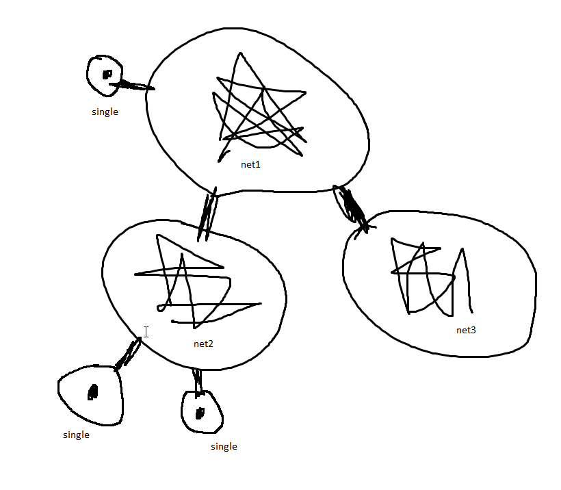

# Exam 15.12 
# Что такое ConfigMap и Secrets? - основные понятия, виды ресурсов + манифесты для каждого типа ресурсов

## ConfigMap

ConfigMap - объект в kubernetes, предназанченый для хранения незащищенныйх данных и последующего их использования другими объектами

ConfigMap пердставляет собой карту вида ключ значение 

```
apiVersion: v1
kind: ConfigMap
metadata:
  name: example111
data:
  field: "cool data"
  new-field: "zxc zxc" 
  new-field2: "zxc zxc 3" 
  new-field3: "zxc zxc 4" 
```

Здесь:

```
apiVersion: v1
kind: ConfigMap
metadata:
  name: field-config-map
```

Обычные даные для любого объекта

```
data:
  field: "cool data"
  new-field1: "zxc zxc 1" 
  new-field2: "zxc zxc 2" 
  new-field3: "zxc zxc 3" 
```

Выше - свами данные хранимые ConfigMap

## Применение ConfigMap

Предположим мы будем использовать ConfigMap для передачи данных в pod 

```
apiVersion: v1
kind: Pod
metadata:
  name: pod-with-config-map
spec:
  containers:
    - name: podName
      image: imageThatNeeddata
      env:
        - name: data-need-fron-field-1 
          valueFrom:
            configMapKeyRef:
              name: field-config-map
              key: new-field1
        - name: data-from-field-2
          valueFrom:
            configMapKeyRef:
              name: field-config-map
              key: new-field2
```

Выше пресдавлено, как может быть сконфигурирован pod, используя в качестве переменных значения из созданной configMap

Но тоаже мы можем взять дашшый из ConfigMap, просто указав его

```
...
containers:
    ...
    envFrom:
        - configMapRef:
            name: field-config-map
    ...
...
```

В этом злучае имена ключей в configMap должны совпадать с именами переменных контенера

## Secrets

Secrets - объект в kubernetes, предназанченый для хранения защищенныйх данных. В принципе Secrets схожи с configMap? За исключением того, что они защищены

Пример секрета в yaml

apiVersion: v1
kind: Secret
metadata:
  name: secret111
data:
  secretData: secretData
  password : password$$$

## Применение Secrets 

Применяются так же как и ConfigMap

Для примера

```
...
containers:
    ...
    envFrom:
        - secretRef:
            name: secret111
    ...
...
```


# Экосистема Polkadot и ее архитектура. Типы и роли узлов в экосистеме.

Polkadot - транстпортная блокчейн технология позволяющая передавать данные через "свободные" блкченыны. 

*пояснение Polkadot основывается на независимой горзонтальной модели различных сетей.



Сеть Polkadot состоит из ролей и узлов (nodes - ноды)

nodes:
* lite clients - те кто пользуется сервисами сети, но сам ен предоставляет сервис другим (не майнит)
* full clients - те кто предоставляет сервисы
* transfer nodes - те кто проксируют трафик между сетями

роли:
* security privider - тот кто обеспечивает защищенный трафик 
* security deligator - тоот кто назанчает security privider, так же собирает данные от security deligators из других сетей
* wathcer - тот кто сделит за выполнением работы security privider
* collector - тот кто собирает данные для формирования блока


Ход работы

1. Происходит запрос на передачу данных
2. collector начинает сделаить за формированием блока
3. security privider получая блок начинает искать кому его пердать
4. когда все security privider собрали достааточно данных из всех сетей они находят того кому передать
5. данные переходя к security privider (получателю) достигают узла, которому они пердназаначались

