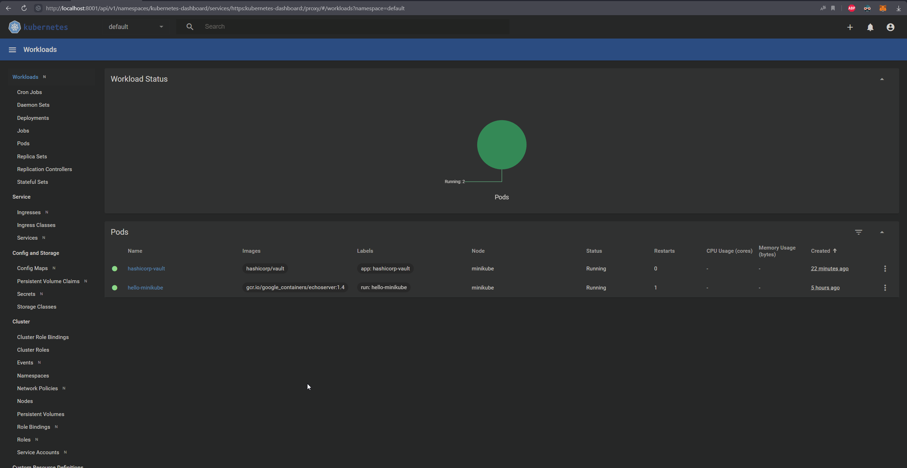
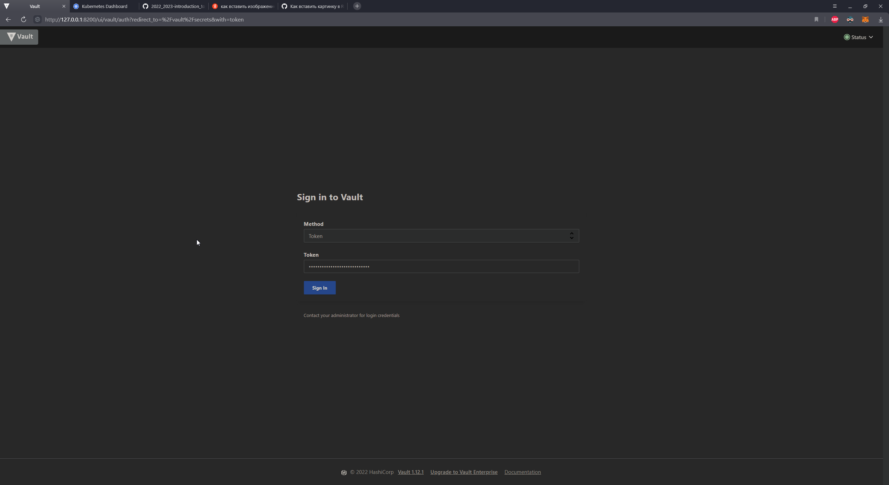
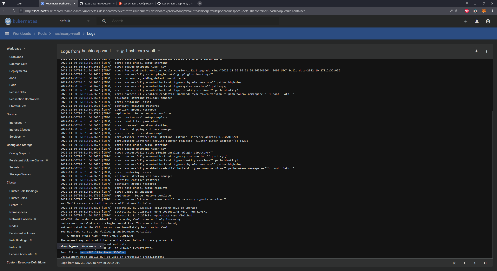
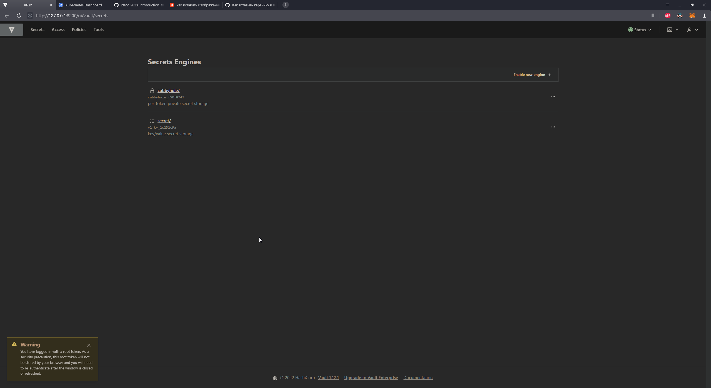

University: [ITMO University](https://itmo.ru/ru/)
Faculty: [FICT](https://fict.itmo.ru)
Course: [Introduction to distributed technologies](https://github.com/itmo-ict-faculty/introduction-to-distributed-technologies)
Year: 2022/2023
Group: K4113c
Author: Chrernigin Ivan Artemovich
Lab: Lab1
Date of create: 30.11.2022
Date of finished: 30.11.2022


# Лабораторная работа №1 "Установка Docker и Minikube, мой первый манифест."
# Ход работы

В данной работе будет испльзоваться Kubernetes Dashboard 

#  Minikube, установка всего необходимого

Устанавливаем minikube, в моем случае через .exe установщик
 
Для запуска minicube прописывем следующую команду в терминале

```html
minicube start
```

# Запуск pod с vault

В качестве первого пода был выбран vault от hashicorp

В нашем случае будет использоваться готовый образ контейнера: hashicorp/vault

Создание сервиса описывается в vaultPod.yaml

```
apiVersion: v1
kind: Pod
metadata:
  name: hashicorp-vault
  namespace: default
  labels:
    app: hashicorp-vault
spec:
  containers:
  - name: hashicorp-vault-container
    image: hashicorp/vault
    ports:
    - containerPort: 8200
```

Для запуска прописываем 
```
kubectl apply -f ???
```
где ??? - путь до созданного yaml файла

В моем случае комана выглядит следующим образом
```
kubectl apply -f C:\kube\vaultPod.yaml
```

Проверяем результ создания пода


Также существующие поды можно посмотреть прописав команду
```
kubectl get pods
```
> эта команда выведет только поды в пространствве default

# Создание сервиса
Для доступа к поду потребуется сервис

Дял его создания требуется прописать команду указав под, для которого создается сервис, тип сервиса и порт

Следующая команда создает сервис для созданного пода

```
kubectl -- expose pod hashicorp-vault --type=NodePort --port=8200
```    

После создания сервиса мы все еще не можем обратиться к нему, тк он находится внутри kubernets,

Для получения доступа достаточно пробросить порты

Дял нашего севиса команда будет выглядеть так:

```
kubectl port-forward service/hashicorp-vault 8200:8200
```

# Вход
Теперь мы можем обратиться к нашему сервису извне

Дял этого заходим на localhost, прописав в пути указанный ранее порт



Для входа в хранилище потребуется ключ, его можно найти в логах контейнера

Логи можно поспотреть следующей командой 

```
kubectl logs hashicorp-vault
```

> здесь hashicorp-vault - имя искомого контейнера

>если не находит, возможно стоит поискать в других пространствах имен, и указать явно



Результат входа


# Вопросы, ответы
-
