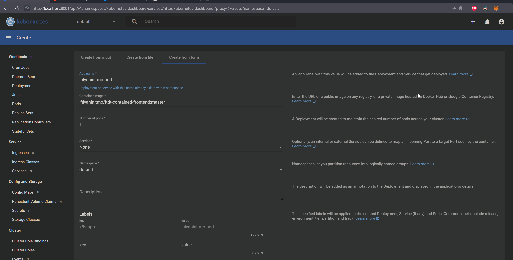
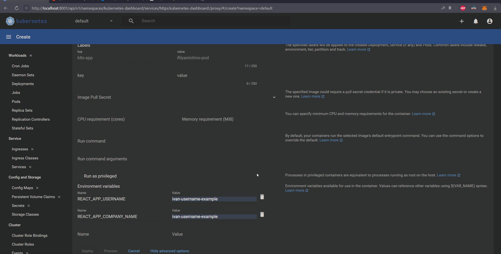
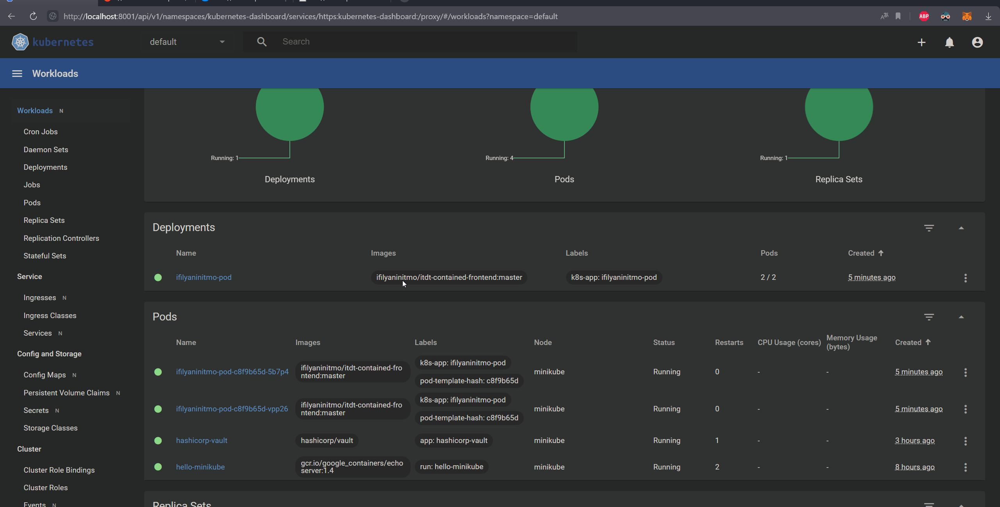
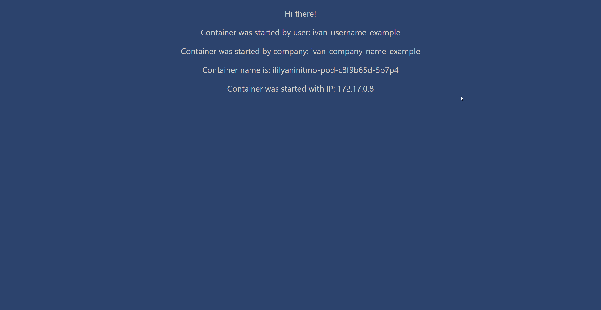
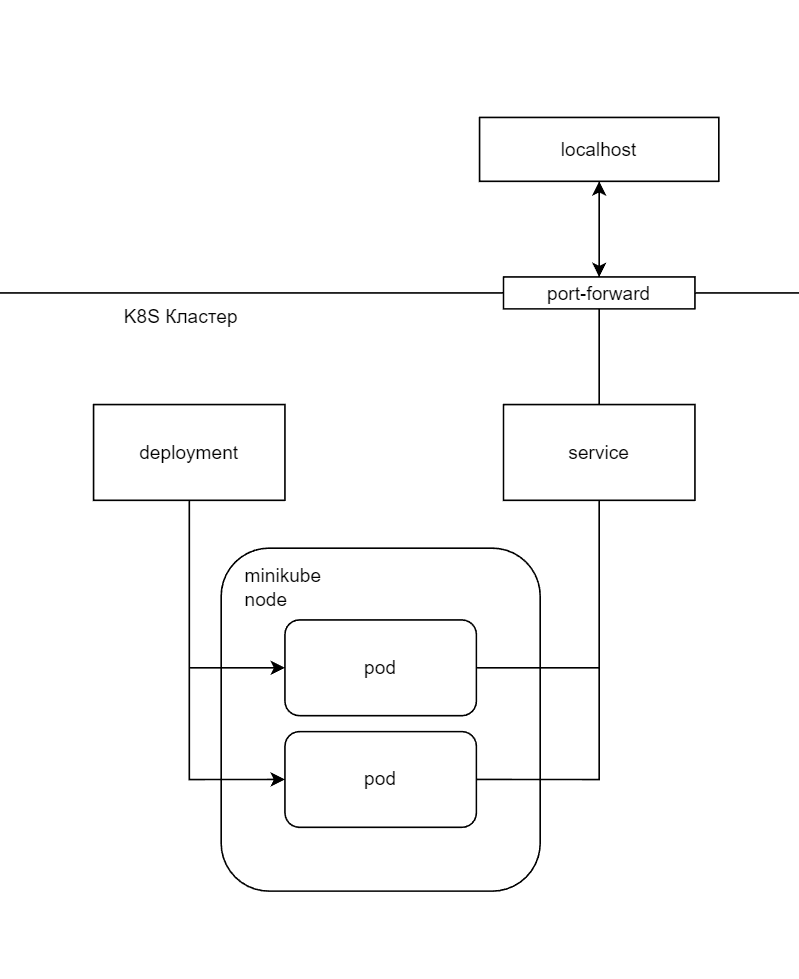
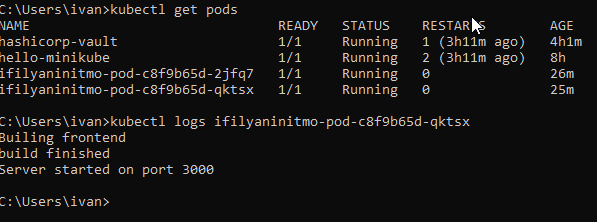

University: [ITMO University](https://itmo.ru/ru/)
Faculty: [FICT](https://fict.itmo.ru)
Course: [Introduction to distributed technologies](https://github.com/itmo-ict-faculty/introduction-to-distributed-technologies)
Year: 2022/2023
Group: K4113c
Author: Chrernigin Ivan Artemovich
Lab: Lab2
Date of create: 30.11.2022
Date of finished: 30.11.2022

# Лабораторная работа №2
# Ход работы

В данной работе будет испльзоваться Kubernetes Dashboard 

#  Minikube, установка всего необходимого

# Ход работы

Предварительно установил Kubernetes Dashboard

# Создание deployment

Для создания deployment можо возспользоваться функционалом Kubernetes Dashboard и все создать с его помощью

На снимках ниже прдставлена конфигурация для создания 





Но для получения идентичного результата можно написать и запустить следующий yaml файл

```
apiVersion: apps/v1
kind: Deployment
metadata:
  name: ifilyaninitmo-pod
  labels:
    app: ifilyaninitm-front
spec:
  replicas: 2
  selector:
    matchLabels:
      app: ifilyaninitmo-pod
  template:
    metadata:
      labels:
        app: ifilyaninitmo-pod
    spec:
      containers:
      - name: ifilyaninitm-front
        image: ifilyaninitmo/itdt-contained-frontend:master
        env:
            - name: REACT_APP_USERNAME
              value: ivan-username-example
            - name: REACT_APP_COMPANY_NAME
              value: ivan-company-name-example
        ports:
        - containerPort: 3000
```

Результат



# Создание сервиса

Аналогично созданибю сервиса для pod, для deployment команда аналогична
```
kubectl expose deployment ifilyaninitmo-pod --type=LoadBalancer --port=3000
```        

И также тербуется проброс портов

```
kubectl port-forward service/ifilyaninitmo-pod 3000:3000
```

## Результат

После проброса можно зайти на http://127.0.0.1:3000 и посмотреть на результат


Логи 1 из контейнеров


3. В deployment.yaml манифкест для развертывания идентичного deployment


# Схема



# Вопросы, ответы

1. логи контейнера 

> 

2. Изменяются ли переменные? Если да то почему?
> **ответ:** В моем случае нет, тк я прописал из значенеи при создании deployment, если указать их в каждом контейнере отдельно то они будут разные.
