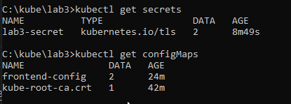

University: [ITMO University](https://itmo.ru/ru/)
Faculty: [FICT](https://fict.itmo.ru)
Course: [Introduction to distributed technologies](https://github.com/itmo-ict-faculty/introduction-to-distributed-technologies)
Year: 2022/2023
Group: K4113c
Author: Chrernigin Ivan Artemovich
Lab: Lab3
Date of create: 30.11.2022
Date of finished: 30.11.2022

# Ход работы

# Создание ConfigMap 

ConfigMap описан в следующем yaml фаqле 

```html
apiVersion: v1
kind: ConfigMap
metadata:
  name: frontend-config
data:
  REACT_APP_USERNAME: "hello-from-configmap-username"
  REACT_APP_COMPANY_NAME: "configmap-company" 
```  

# Создание Deployment

Deployment описан в следующем yaml фаqле 

Здесь используется ранее созданный ConfigMap (frontend-config)

```html
apiVersion: apps/v1
kind: Deployment
metadata:
  name: lab3-front
  labels:
    app: lab3-front
spec:
  replicas: 2
  selector:
    matchLabels:
      app: lab3-front
  template:
    metadata:
      labels:
        app: lab3-front
    spec:
      containers:
        - name: lab3-front
          image: ifilyaninitmo/itdt-contained-frontend:master
          ports:
            - containerPort: 3000
          envFrom:
            - configMapRef:
                name: frontend-config
```

# Запуск yaml файлов

```
kubectl apply -f C:\kube\lab3\configmap.yaml
kubectl apply -f C:\kube\lab3\deployment.yaml
```


# Генерация сертификата

В Данной лобораьорной работе будет создаваться защищенное соединение, для него нужен ключ и сертификат.

Я их сгенерировал онлайн

https://certificatetools.com/

Резульаты сохранены в cert.crt и cert.key

# Секреты

Добавляем в секреты ранее созданный серификат и ключ

```
kubectl create secret tls lab3-secret --cert=cert.crt --key=cert.key
```

# Промежуточные результаты




# Создание сервиса

Можно запустить, через команду

```
kubectl expose deployment lab3-front --type=LoadBalancer --port=3000
```

А можно через yaml

```
apiVersion: v1
kind: Service
metadata:
 name: lab3-service
spec:
 selector:
   app: lab3-front
 ports:
   - protocol: TCP
     port: 3000
     targetPort: 3000
```

```
kubectl apply -f C:\kube\lab3\service.yaml
```

# Создание Ingress

Ingress:

```
apiVersion: networking.k8s.io/v1
kind: Ingress
metadata:
 name: lab3-ingress
spec:
 rules:
   - host: lab3-frontend.org
     http:
       paths:
         - backend:
             service:
               name: lab3-service
               port:
                 number: 3000
           path: /
           pathType: Prefix
 tls:
   - hosts:
       - lab3-frontend.org
     secretName: lab3-secret
```

```
kubectl apply -f C:\kube\lab3\ingress.yaml
```

Также включаем ingress addons

```
kubectl addons enable ingress
```

# Дополнительные действия

Смотрим созданный ingress

```
kubectl get ingress
kubectl get ingress-dns
```


Прописываем данный адрес и ip в фалй hosts

> Я так и не смог достучаться до этого ip
> Но как я понял, раз minicube запущен локально, то и прописывать нужно не то что указано 192...
> А 127.0.0.1, те localhost

Прописываем

```
minicube tunnel
```

# Результат


# Схема


