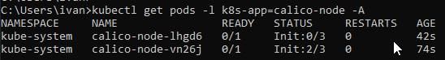
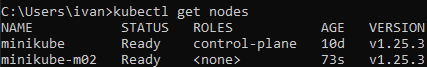
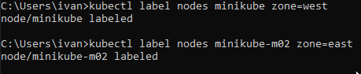
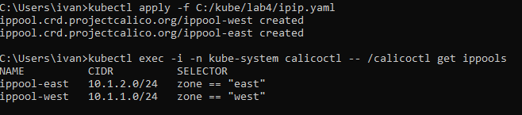
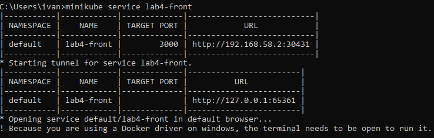
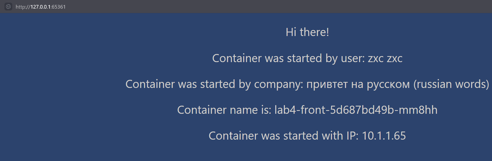

University: [ITMO University](https://itmo.ru/ru/)
Faculty: [FICT](https://fict.itmo.ru)
Course: [Introduction to distributed technologies](https://github.com/itmo-ict-faculty/introduction-to-distributed-technologies)
Year: 2022/2023
Group: K4113c
Author: Chrernigin Ivan Artemovich
Lab: Lab2
Date of create: 30.11.2022
Date of finished: 30.11.2022

# Лабораторная работа №4 "Сети связи в Minikube, CNI и CoreDNS"
# Ход работы
# Запуск нескольких нод в minikube


как обыно запускаем minikube, но прописывая следующие аргумены

```
minikube start --nodes 2 --kubernetes-version=v1.25.2 --network-plugin=cni --cni=calico 
```

Прверяем установку плагина Calico 

```
kubectl get pods -l k8s-app=calico-node -A

Как видно на скриншоте плагин установвился, но еще не запустился
```


Посмотреть существующие ноды можно командой 

```
kubectl get nodes
```

На скриншоте мои зупущенные ноды



Также для дальнейшей работы необходимо запустить calicoctl.yaml из документации

# Назначение лейблов для нод

Назначаем лейблы для каждой из созданных нод

```
kubectl label nodes minikube zone=west
kubectl label nodes minikube-m02 zone=east
```

В результате дложно появиться сообщение об еспешном добавлении



# Создание IP пула

Исполузуя ранее созданные лейблы, прописываем yaml файл, в котором указываем cеть для calico и "привязываем" к адресам наши ноды по их лейблам

> Здесь: 10.1.1.0/24 создаваемая подсеть находится в сети с маской 24, тоессть 10.1.1.0

```
apiVersion: projectcalico.org/v1
kind: IPPool
metadata:
   name: ippool-west
spec:
   cidr: 10.1.1.0/24
   ipipMode: Always
   natOutgoing: true
   nodeSelector: zone == "west"
---

apiVersion: projectcalico.org/v1
kind: IPPool
metadata:
   name: ippool-east
spec:
   cidr: 10.1.2.0/24
   ipipMode: Always
   natOutgoing: true
   nodeSelector: zone == "east"
```

Как обычно применяем yaml, в результате должны появиться сообщения об успешном создании пулов



# Добавленеи приложения на ноды

Аналогично, из предыдущих работ создаем dep.yaml (деплоймент) и serv.yaml (сервис) после пробрасываем порты

кратко про запуск...

```
kubectl apply -f c:/kube/lab4/dep.yaml
kubectl apply -f c:/kube/lab4/serv.yaml
```

>странно, что сервис не работал, так что я прописал его вручную
>```
>kubectl expose deployment lab4-front --type=LoadBalancer --port=3000
>```

# Запуск запуск приложения

Запускаем командой 

```
minikube service lab4-front
```



В браузере



